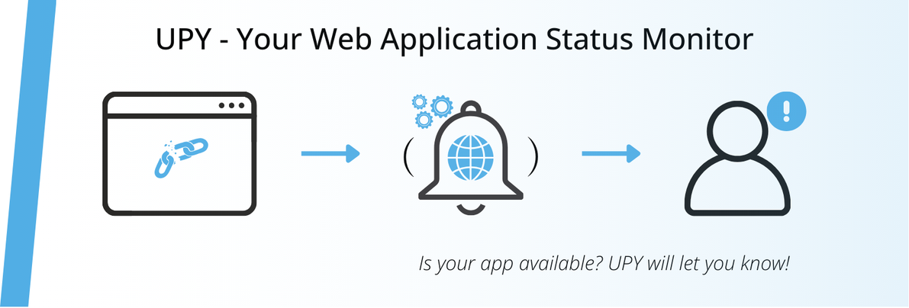

  

# UPY – Your Web Application Status Monitor
_Is your app available? UPY will let you know!_

---

**UPY** is a microservices-based SaaS platform that helps you track the availability of your web applications in real time.  
It automatically checks if your app is online and sends instant notifications if something goes wrong.

## ✨ Key Features
- Real-time monitoring
- Instant alerts via **Telegram**
- Easy to set up and manage

Whether you’re managing a small blog or a large production service, UPY ensures you’re the first to know when downtime happens.

---

> **⚠️ Project Status:** Currently in development.  

